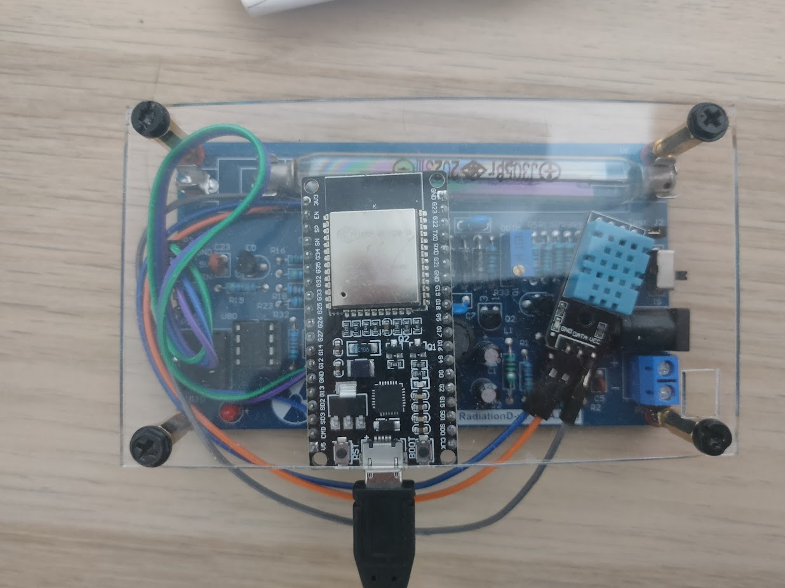

<h1>Instructions</h1>
<ol>
 <li>Connect the esp32, dht11 and the geiger counter</li>
  <li>Download HomeTelemetryStation.ino, replace your wifi credantials and set your static ip (optional)</li>
 <li>Upload the scketch to the esp32</li>
 <li>When the initial data gathering is finished you can use the /data endpoint to get your json file</li>
</ol>
<h1>Diagram</h1>
 
<h1>Parts Used</h1>
<ul>
  <li>
ESP 32

    
  </li>
  <li>
DHT11 - Tempreture and Humidity Sensor

    
  </li>
  <li>
DIY Geiger Counter

    
  </li>
</ul>
<h1>Photos</h1>

